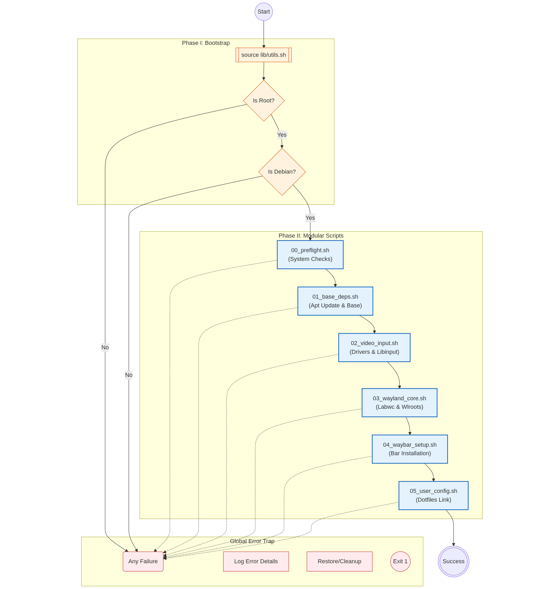

# Debian 13 (Trixie) Minimal Setup: Labwc + Waybar

This will be a Bash orchestration script to automate the installation of a minimal Wayland environment using **Labwc** (Compositor) and **Waybar** (Status Bar) on Debian 13.

---

## Quick Start (not finished yet...)

### Prerequisites

  * **OS:** Debian 13 "Trixie" (Stable)
  * **User:** Must be run as `root` (or via `sudo`).
  * **Internet:** Active connection required for `apt` and `git`.

### Installation

1.  **Clone the repository:**

    ```bash
    git clone [https://github.com/yourusername/debian-labwc-setup.git](https://github.com/yourusername/debian-labwc-setup.git)
    cd debian-labwc-setup
    ```

2.  **Make the script executable:**

    ```bash
    chmod +x main.sh
    ```

3.  **Run the Orchestrator:**

    ```bash
    sudo ./main.sh
    ```

-----

## 📂 Project Structure

| Directory | Description |
| :--- | :--- |
| **`main.sh`** | The entry point. Initializes logging and runs steps in order. |
| **`lib/`** | Contains `utils.sh` (logging colors, error traps, validation functions). |
| **`steps/`** | Numbered scripts containing the actual logic. |
| **`config/`** | Source dotfiles for Labwc and Waybar (symlinked during install). |
| **`logs/`** | Auto-generated logs for every installation attempt. |
| **`img/`** | Image source files. |
| **`docs/`** | Documentation assets and architecture source files. |
-----

## 🛡 Features

  * **Atomic Execution:** The script stops immediately if any step fails (`set -e`).
  * **Validation First:** Checks for internet connectivity, root privileges, and OS version before making changes.
  * **Detailed Logging:** Every action is logged to `logs/install_YYYY-MM-DD.log`.
  * **Idempotent-ish:** Checks if packages are already installed to speed up re-runs.


## 🏗 Architecture

The installation process is driven by a central orchestrator (`install.sh`) that executes isolated, numbered steps. The system relies on a global error trap and strict validation logic.



## 📄 License

This project is licensed under the **MIT License**. See the [LICENSE](LICENSE.txt) file for details.